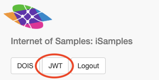
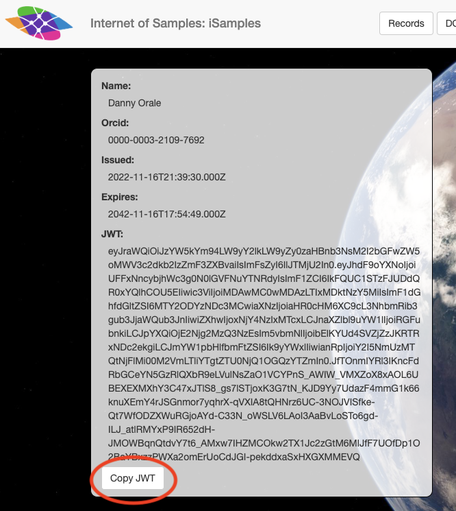

# iSamples Authentication and Identifier Minting

iSamples identifier minting is provided using [DataCite DOIs](https://datacite.org).  Only users that have been authenticated using [orcid](https://orcid.org) are allowed to mint identifiers.  Additionally, users have to be granted access using the iSamples admin API in order to mint identifiers.

## Authentication using orcid

The first step in minting an identifier is authenticating using orcid.  Users will first need to register for an orcid id at https://orcid.org.  Once users have created their identifier, the login process is initiated by hitting the login URL at the hosted iSamples in a Box instance, e.g. on [Mars](https://mars.cyverse.org/isamples_central/manage/login).

### Config keys
In order to configure which orcid developer app values to use when proxying the orcid authentication service, the following config keys exist:

```
ORCID_CLIENT_ID="example id"
ORCID_CLIENT_SECRET="example secret"
ORCID_ISSUER="https://sandbox.orcid.org"
```

You may obtain these values by logging into your account on orcid and clicking on the developer settings tab.  Note that if you are using the production
orcid site, you'll need to make sure to update the `ORCID_ISSUER` config to point to https://orcid.org

Obviously before any of that will work, you'll need to have configured your orcid account for development access.  Details for doing so are available at [orcid](https://info.orcid.org/documentation/integration-guide/registering-a-public-api-client/#easy-faq-2606).

### Python oauth implementation using authlib

Under the covers, orcid is using [openid](https://info.orcid.org/documentation/api-tutorials/api-tutorial-get-and-authenticated-orcid-id/#easy-faq-2731), which is really just an enhancement of the standard [3-legged oauth](https://info.orcid.org/documentation/api-tutorials/api-tutorial-get-and-authenticated-orcid-id/#easy-faq-2537) pattern.

The iSamples implementation of these pieces are located in [manage.py](https://github.com/isamplesorg/isamples_inabox/blob/develop/isb_web/manage.py), which contains all the necessary logic for dealing with managing identifiers.

Most of the functionality is abstracted away in the `authlib` integration, and iSamples just constructs that library and specifies the necessary parameters:

```
oauth = authlib.integrations.starlette_client.OAuth()

oauth.register(
    name="orcid",
    client_id=config.Settings().orcid_client_id,
    client_secret=config.Settings().orcid_client_secret,
    server_metadata_url=config.Settings().orcid_issuer + "/.well-known/openid-configuration",
    client_kwargs={"scope": "openid"},
    api_base_url=config.Settings().orcid_issuer,
)

@manage_api.get("/login")
async def login(request: starlette.requests.Request):
    """
    Initiate OAuth2 login with ORCID
    """
    redirect_uri = request.url_for("auth")
    return await oauth.orcid.authorize_redirect(request, redirect_uri)
    
@manage_api.get("/auth")
async def auth(request: starlette.requests.Request):
    """
    This method is called back by ORCID oauth. It needs to be in the
    registered callbacks of the ORCID Oauth configuration.
    """
    token = await oauth.orcid.authorize_access_token(request)
    request.session["user"] = dict(token)
    redirect_url = url_utilities.joined_url(str(request.url), config.Settings().auth_response_redirect_fragment)
    return starlette.responses.RedirectResponse(url=redirect_url)    
```

The only additional step required is to sure that the `/auth` handler URL is registered as a valid redirect URL in the orcid management console.

### Python middleware using starlette_oauth2_api

The `starlette_oauth2_api.AuthenticateMiddleware` ensures that users are authenticated when they attempt to access any of the FastAPI manage handlers.  The middleware effectively intercepts all manage API requests and redirects them if there isn't a validated session, or the orcid id associated with the session isn't allowed to access the site.  The implementation is relatively straightforward, just adding the middleware to the FastAPI manage handler:

```
manage_api.add_middleware(
    AuthenticateMiddleware,
    providers={
        "orcid": {
            "issuer": config.Settings().orcid_issuer,
            "keys": config.Settings().orcid_issuer + "/oauth/jwks",
            "audience": config.Settings().orcid_client_id,
        }
    },
    public_paths={"/login", "/auth", "/logout"},
)
```
and it takes care of all the key verification details.

### HTTP Errors
As a general convention, the http errors are as follows:

1. **400** -- malformed request (likely bad token or authorization header)
1. **401** -- insufficient permission -- user doesn't have access to update assets or the particular asset they're trying to update
1. **404** -- unable to locate the resource with the specified identifier

## Obtaining the JWT from the UI
In order to invoke any of the management scripts, you'll need a valid JWT.  You may obtain the JWT by logging into the iSamples UI and clicking on this link:


That will take you to the JWT page, and you can copy the value of the JWT by clicking the following button on that page:


Then, when you invoke any of the management scripts, you include the copied value of the JWT using the `--identity-token` (`-t`) parameter.

## Management of users using config and the API

Once users have their orcid ids established and the auth URLs are registered using the datacite API, the manage API can be used to manage the orcid id access list.  There are two levels of access in the iSamples management scheme:

(1) Superusers are able to add other orcid ids to the permissions list using the `/manage/add_orcid_id` API.  Superusers are controlled via the `orcid_superusers` config key.

(2) Regular users are able to mint identifiers using datacite but are not able to add other users to the list of users that are allowed to mint identifiers.  Superusers may add regular users to the iSB instance by hitting the `/manage/add_orcid_id` endpoint and passing in the `orcid_id` parameter.

## Minting identifiers using datacite

Once all of the above has been completed, you're ready to mint new identifiers with datacite.  There are two ways to do so: by using the management UI or by using a CLI that directly hits the identifier minting endpoint.

(1) Using the management UI, hit the `/dois` URL in the ISB instance e.g. on [Mars](https://mars.cyverse.org/isamples_central/ui/#/dois) and enter the required fields.  You can see the generated JSON in the right-side panel, and that generated JSON is sent to datacite.  Once the datacite response comes back, you'll be able to see the newly minted identifier.

(2) Similarly, you can also use a CLI to directly hit the iSB `/manage/mint_draft_identifiers` endpoint and mint identifiers using your scripting language of choice.  The only prerequisite here is to make sure you've obtained a valid JWT from orcid before calling the endpoint.  You'll need to include the JWT in an `authorization: Bearer` header when you call the endpoint.  A working example of a CLI is available on the [iSamples GitHub](https://github.com/isamplesorg/isamples_inabox/blob/develop/scripts/examples/mint_identifiers_cli.py)

## Minting identifiers using noidy

As an alternative to using datacite for identifier minting, you may also use the iSamples built-in identifier minter, noidy.

The first thing you'll need to do is create a namespace.  There's a command in `scripts/examples/mint_identifiers_cli.py`.  An example invocation follows:

```
python scripts/examples/mint_identifiers_cli.py create_namespace -i orcid_id1,orcid_id2 -t <JWT> -u http://localhost:8000/manage/add_namespace -s 1234/fk4
```

Once you've created the namespace, you can then call the service to mint identifiers.

There's an example of how to call the noidy service in `scripts/examples/mint_identifiers_cli.py`.  The parameters are
as follows:

```
python scripts/examples/mint_identifiers_cli.py mint_noidy_identifiers -t <JWT> -u http://localhost:8000/manage/mint_noidy_identifiers -n 10 -s 1234/fk4
```

For the shoulder (`-s`) parameter, you'll need to ensure that the namespace with the specified shoulder exists in the database and that your orcid id has access to it 
prior to calling the service.  You'll also need to have logged in to the iSamples WebUI and copied the JWT string value before attempting to hit the service.